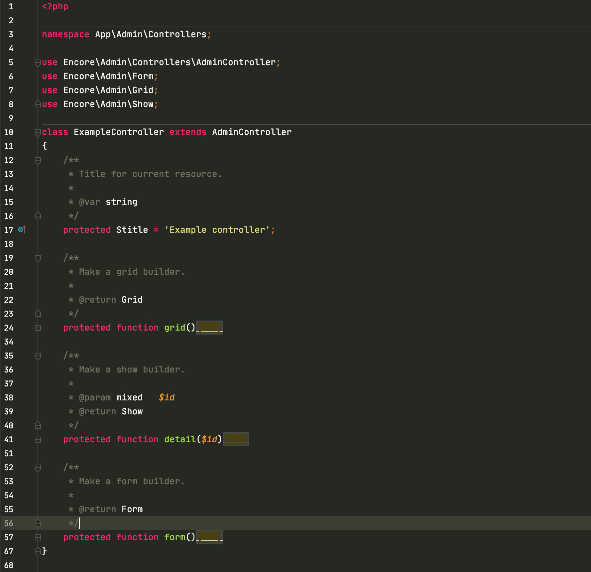
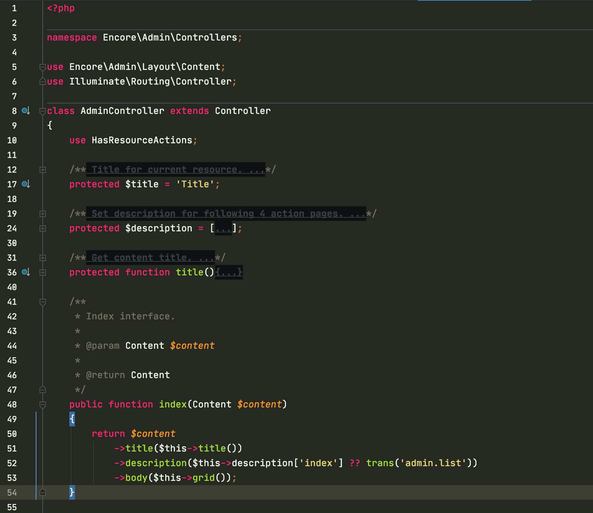
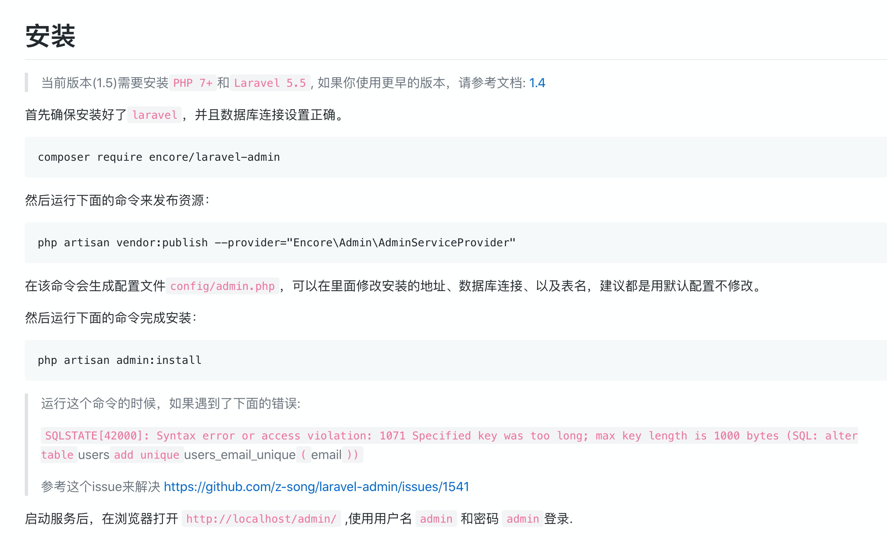

# laravel-admin 源码


使用这个框架创建的 `Controller`, 都继承了 `AdminController`. 如图. 




查看 `AdminController`. 列表页走的路由是 index. 



可以看到, 使用的是 `Encore\Admin\Layout\Content`.


>   代码片段1.

```php
<?php

namespace Encore\Admin\Layout;

use Closure;
use Illuminate\Contracts\Support\Renderable;
use Illuminate\Support\Arr;

class Content implements Renderable
{
    // ........
    
    /**
     * Render this content.
     *
     * @return string
     */
    public function render()
    {
        $items = [
            'header'      => $this->title,
            'description' => $this->description,
            'breadcrumb'  => $this->breadcrumb,
            'content'     => $this->build(),
        ];

        return view('admin::content', $items)->render();
    }
}

```

可以看到. 最终渲染的是哪个模板了. 


为什么`return view('admin::content', $items)->render();` 中使用的是 `admin::content`

前面的 `admin` 是命名空间. 具体文档: [扩展包开发: 视图](https://learnku.com/docs/laravel/7.x/packages/7490#views)


laravel-admin 是在哪里定义的呢? 

`Yourobject/vendor/encore/laravel-admin/src/AdminServiceProvider.php` 


在安装 `laravel-admin` 的时候, 会要求发布资源. [laravel-admin 安装](https://laravel-admin.org/docs/zh/installation)




具体为什么这么弄, 查看文档 [扩展包开发: 服务提供者](https://learnku.com/docs/laravel/7.x/packages/7490#service-providers)


等等. 是如何使用这个模板的呢? 

我们写代码, 根本就没有调用 `render` 方法啊. 


那是因为. `Content`实现了`Illuminate\Contracts\Support\Renderable`. 

在 `代码片段1` 中可以看到. `class Content implements Renderable`


而 `Illuminate\Contracts\Support\Renderable` 只是定义的一个 `interface`. 


```php
<?php

namespace Illuminate\Contracts\Support;

interface Renderable
{
    /**
     * Get the evaluated contents of the object.
     *
     * @return string
     */
    public function render();
}

```


又出现了一个问题, 为什么实现了 `Renderable` 就会被调用呢? 


那是因为. 在 `YourObject/vendor/laravel/framework/src/Illuminate/Http/Response.php`

中. 判断了. 


```php
<?php

namespace Illuminate\Http;

use ArrayObject;
use JsonSerializable;
use Illuminate\Support\Traits\Macroable;
use Illuminate\Contracts\Support\Jsonable;
use Illuminate\Contracts\Support\Arrayable;
use Illuminate\Contracts\Support\Renderable;
use Symfony\Component\HttpFoundation\Response as BaseResponse;

class Response extends BaseResponse
{
    use ResponseTrait, Macroable {
        Macroable::__call as macroCall;
    }

    /**
     * Set the content on the response.
     *
     * @param  mixed  $content
     * @return $this
     */
    public function setContent($content)
    {
        $this->original = $content;

        // If the content is "JSONable" we will set the appropriate header and convert
        // the content to JSON. This is useful when returning something like models
        // from routes that will be automatically transformed to their JSON form.
        if ($this->shouldBeJson($content)) {
            $this->header('Content-Type', 'application/json');

            $content = $this->morphToJson($content);
        }

        // If this content implements the "Renderable" interface then we will call the
        // render method on the object so we will avoid any "__toString" exceptions
        // that might be thrown and have their errors obscured by PHP's handling.
        elseif ($content instanceof Renderable) {
            $content = $content->render();
        }

        parent::setContent($content);

        return $this;
    }
}

```

在 41 行, 判断了是否属于这个接口, 属于, 就调用 render 方法. 


所以, 只要某个类实现了`Illuminate\Contracts\Support\Renderable`, 在 Controller 层返回这个类的实例, laravel 框架就会调用这个类的render方法. 


这里举个例子. 


新建一个 controller, 这里直接返回了一个类的实例. 


```php
<?php

namespace App\Http\Controllers;

use App\Services\TestRender;

class HomeController extends Controller
{
    public function index()
    {
        return new TestRender();
    }
}

```


这个类实现了 `Illuminate\Contracts\Support\Renderable`. 

```php
<?php

namespace App\Services;

use Illuminate\Contracts\Support\Renderable;

class TestRender implements Renderable
{
    public function render()
    {
        return 'test';
    }
}

```

页面会输出 `test`.


laravel框架是怎么走到 `setContent` 方法的. 你去看源码吧. 


