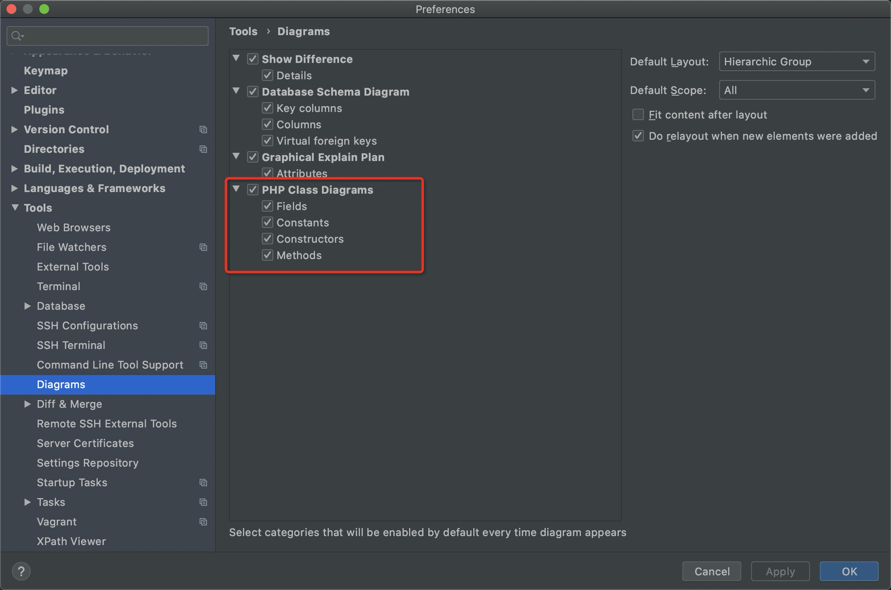
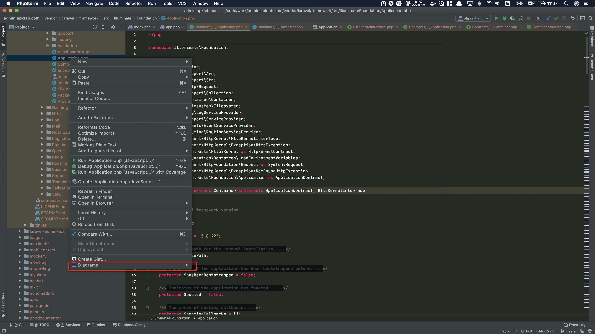
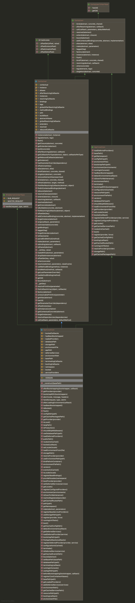
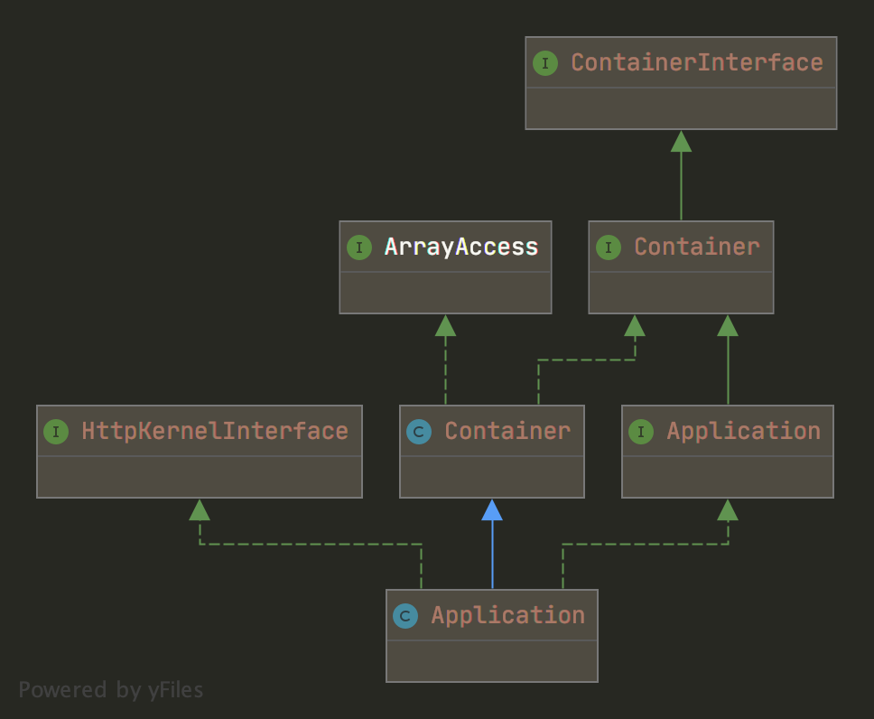

# laravel 容器


>   在 Laravel 中经常提及的服务容器就是这里的 IoC 容器，你可以把服务容器看作 IoC 容器在 Laravel 框架中的方言别名，两者等价。
>
>   服务提供者（可以理解为一个专门用于绑定接口与实现到服务容器的地方）Laravel 服务提供者主要用来进行注册服务容器绑定（即注册接口及其实现类的绑定）
>
>   [学院君: 服务容器篇](https://xueyuanjun.com/books/laravel-from-appreciate-to-artisan/chapter/service-container)


在入口文件中. 通过

```php
$app = require_once __DIR__.'/../bootstrap/app.php';
```

来加载了容器. 


```php
<?php

$app = new Illuminate\Foundation\Application(
    $_ENV['APP_BASE_PATH'] ?? dirname(__DIR__)
);

$app->singleton(
    Illuminate\Contracts\Http\Kernel::class,
    App\Http\Kernel::class
);

$app->singleton(
    Illuminate\Contracts\Console\Kernel::class,
    App\Console\Kernel::class
);

$app->singleton(
    Illuminate\Contracts\Debug\ExceptionHandler::class,
    App\Exceptions\Handler::class
);

return $app;

```


重点看一下 `Illuminate\Foundation\Application` 这个类. 


## 使用 phpstorm 生成类图


这个类实现了好几个抽象类. 也继承了别的类. 关系有点乱. 

这里有一个好的方法. 就是使用 phpstorm 的一个功能, 可以生成类图. 





首先把这个都给选中. 默认是不选中的.





在项目目录中, 选中想要查看类图的文件后, 右键, 然后选择 `Diagrams` 就可以了. 就会生成类的关系图. 


## 类图(详细)




这个图太长了. 也证明了 容器 是很复杂的. 


## 类图关系 (简要)

下面是类的关系图. 隐藏了方法和属性等信息. 




这几个类呢. 一个一个来说. 


先从最上层的看起. 


## Psr\Container\ContainerInterface

```php
<?php
namespace Psr\Container;

interface ContainerInterface
{
    public function get($id);
    public function has($id);
}

```

 需要先了解一下 PSR-11. [PSR-11 容器接口](https://learnku.com/docs/psr/psr-11-container/1621),  [PSR-11 容器接口 - 说明文档](https://learnku.com/docs/psr/psr-11-container-meta/1622)

这个接口就是 PSR-11 规定的. 所以像 laravel 这种框架, 肯定是实现了. 


## Illuminate\Contracts\Container\Container

```php
<?php

namespace Illuminate\Contracts\Container;

use Closure;
use Psr\Container\ContainerInterface;

interface Container extends ContainerInterface
{
    /**
     * Determine if the given abstract type has been bound.
     *
     * @param  string  $abstract
     * @return bool
     */
    public function bound($abstract);

    /**
     * Alias a type to a different name.
     *
     * @param  string  $abstract
     * @param  string  $alias
     * @return void
     *
     * @throws \LogicException
     */
    public function alias($abstract, $alias);

    /**
     * Assign a set of tags to a given binding.
     *
     * @param  array|string  $abstracts
     * @param  array|mixed   ...$tags
     * @return void
     */
    public function tag($abstracts, $tags);

    /**
     * Resolve all of the bindings for a given tag.
     *
     * @param  string  $tag
     * @return iterable
     */
    public function tagged($tag);

    /**
     * Register a binding with the container.
     *
     * @param  string  $abstract
     * @param  \Closure|string|null  $concrete
     * @param  bool  $shared
     * @return void
     */
    public function bind($abstract, $concrete = null, $shared = false);

    /**
     * Register a binding if it hasn't already been registered.
     *
     * @param  string  $abstract
     * @param  \Closure|string|null  $concrete
     * @param  bool  $shared
     * @return void
     */
    public function bindIf($abstract, $concrete = null, $shared = false);

    /**
     * Register a shared binding in the container.
     *
     * @param  string  $abstract
     * @param  \Closure|string|null  $concrete
     * @return void
     */
    public function singleton($abstract, $concrete = null);

    /**
     * "Extend" an abstract type in the container.
     *
     * @param  string    $abstract
     * @param  \Closure  $closure
     * @return void
     *
     * @throws \InvalidArgumentException
     */
    public function extend($abstract, Closure $closure);

    /**
     * Register an existing instance as shared in the container.
     *
     * @param  string  $abstract
     * @param  mixed   $instance
     * @return mixed
     */
    public function instance($abstract, $instance);

    /**
     * Add a contextual binding to the container.
     *
     * @param  string  $concrete
     * @param  string  $abstract
     * @param  \Closure|string  $implementation
     * @return void
     */
    public function addContextualBinding($concrete, $abstract, $implementation);

    /**
     * Define a contextual binding.
     *
     * @param  string|array  $concrete
     * @return \Illuminate\Contracts\Container\ContextualBindingBuilder
     */
    public function when($concrete);

    /**
     * Get a closure to resolve the given type from the container.
     *
     * @param  string  $abstract
     * @return \Closure
     */
    public function factory($abstract);

    /**
     * Flush the container of all bindings and resolved instances.
     *
     * @return void
     */
    public function flush();

    /**
     * Resolve the given type from the container.
     *
     * @param  string  $abstract
     * @param  array  $parameters
     * @return mixed
     *
     * @throws \Illuminate\Contracts\Container\BindingResolutionException
     */
    public function make($abstract, array $parameters = []);

    /**
     * Call the given Closure / class@method and inject its dependencies.
     *
     * @param  callable|string  $callback
     * @param  array  $parameters
     * @param  string|null  $defaultMethod
     * @return mixed
     */
    public function call($callback, array $parameters = [], $defaultMethod = null);

    /**
     * Determine if the given abstract type has been resolved.
     *
     * @param  string $abstract
     * @return bool
     */
    public function resolved($abstract);

    /**
     * Register a new resolving callback.
     *
     * @param  \Closure|string  $abstract
     * @param  \Closure|null  $callback
     * @return void
     */
    public function resolving($abstract, Closure $callback = null);

    /**
     * Register a new after resolving callback.
     *
     * @param  \Closure|string  $abstract
     * @param  \Closure|null  $callback
     * @return void
     */
    public function afterResolving($abstract, Closure $callback = null);
}

```

注释写的很明白. 

是 `Illuminate\Contracts` 规定的契约. 

都是一些与容器相关的方法. 都是围绕着 `绑定` 和 `解析` 的方法. 


##  Illuminate\Contracts\Foundation\Application


```php
<?php

namespace Illuminate\Contracts\Foundation;

use Closure;
use Illuminate\Contracts\Container\Container;

interface Application extends Container
{
    /**
     * Get the version number of the application.
     *
     * @return string
     */
    public function version();

    /**
     * Get the base path of the Laravel installation.
     *
     * @return string
     */
    public function basePath();

    /**
     * Get the path to the bootstrap directory.
     *
     * @param  string  $path Optionally, a path to append to the bootstrap path
     * @return string
     */
    public function bootstrapPath($path = '');

    /**
     * Get the path to the application configuration files.
     *
     * @param  string  $path Optionally, a path to append to the config path
     * @return string
     */
    public function configPath($path = '');

    /**
     * Get the path to the database directory.
     *
     * @param  string  $path Optionally, a path to append to the database path
     * @return string
     */
    public function databasePath($path = '');

    /**
     * Get the path to the environment file directory.
     *
     * @return string
     */
    public function environmentPath();

    /**
     * Get the path to the resources directory.
     *
     * @param  string  $path
     * @return string
     */
    public function resourcePath($path = '');

    /**
     * Get the path to the storage directory.
     *
     * @return string
     */
    public function storagePath();

    /**
     * Get or check the current application environment.
     *
     * @param  string|array  $environments
     * @return string|bool
     */
    public function environment(...$environments);

    /**
     * Determine if the application is running in the console.
     *
     * @return bool
     */
    public function runningInConsole();

    /**
     * Determine if the application is running unit tests.
     *
     * @return bool
     */
    public function runningUnitTests();

    /**
     * Determine if the application is currently down for maintenance.
     *
     * @return bool
     */
    public function isDownForMaintenance();

    /**
     * Register all of the configured providers.
     *
     * @return void
     */
    public function registerConfiguredProviders();

    /**
     * Register a service provider with the application.
     *
     * @param  \Illuminate\Support\ServiceProvider|string  $provider
     * @param  bool   $force
     * @return \Illuminate\Support\ServiceProvider
     */
    public function register($provider, $force = false);

    /**
     * Register a deferred provider and service.
     *
     * @param  string  $provider
     * @param  string|null  $service
     * @return void
     */
    public function registerDeferredProvider($provider, $service = null);

    /**
     * Resolve a service provider instance from the class name.
     *
     * @param  string  $provider
     * @return \Illuminate\Support\ServiceProvider
     */
    public function resolveProvider($provider);

    /**
     * Boot the application's service providers.
     *
     * @return void
     */
    public function boot();

    /**
     * Register a new boot listener.
     *
     * @param  callable  $callback
     * @return void
     */
    public function booting($callback);

    /**
     * Register a new "booted" listener.
     *
     * @param  callable  $callback
     * @return void
     */
    public function booted($callback);

    /**
     * Run the given array of bootstrap classes.
     *
     * @param  array  $bootstrappers
     * @return void
     */
    public function bootstrapWith(array $bootstrappers);

    /**
     * Determine if the application configuration is cached.
     *
     * @return bool
     */
    public function configurationIsCached();

    /**
     * Detect the application's current environment.
     *
     * @param  \Closure  $callback
     * @return string
     */
    public function detectEnvironment(Closure $callback);

    /**
     * Get the environment file the application is using.
     *
     * @return string
     */
    public function environmentFile();

    /**
     * Get the fully qualified path to the environment file.
     *
     * @return string
     */
    public function environmentFilePath();

    /**
     * Get the path to the configuration cache file.
     *
     * @return string
     */
    public function getCachedConfigPath();

    /**
     * Get the path to the cached services.php file.
     *
     * @return string
     */
    public function getCachedServicesPath();

    /**
     * Get the path to the cached packages.php file.
     *
     * @return string
     */
    public function getCachedPackagesPath();

    /**
     * Get the path to the routes cache file.
     *
     * @return string
     */
    public function getCachedRoutesPath();

    /**
     * Get the current application locale.
     *
     * @return string
     */
    public function getLocale();

    /**
     * Get the application namespace.
     *
     * @return string
     *
     * @throws \RuntimeException
     */
    public function getNamespace();

    /**
     * Get the registered service provider instances if any exist.
     *
     * @param  \Illuminate\Support\ServiceProvider|string  $provider
     * @return array
     */
    public function getProviders($provider);

    /**
     * Determine if the application has been bootstrapped before.
     *
     * @return bool
     */
    public function hasBeenBootstrapped();

    /**
     * Load and boot all of the remaining deferred providers.
     *
     * @return void
     */
    public function loadDeferredProviders();

    /**
     * Set the environment file to be loaded during bootstrapping.
     *
     * @param  string  $file
     * @return $this
     */
    public function loadEnvironmentFrom($file);

    /**
     * Determine if the application routes are cached.
     *
     * @return bool
     */
    public function routesAreCached();

    /**
     * Set the current application locale.
     *
     * @param  string  $locale
     * @return void
     */
    public function setLocale($locale);

    /**
     * Determine if middleware has been disabled for the application.
     *
     * @return bool
     */
    public function shouldSkipMiddleware();

    /**
     * Terminate the application.
     *
     * @return void
     */
    public function terminate();
}

```


这个类的方法, 都是关于全局配置的东西, 例如: 路径, 本地化, 注册服务提供者等等. 


## ArrayAccess

```php
/**
 * Interface to provide accessing objects as arrays.
 * @link https://php.net/manual/en/class.arrayaccess.php
 */
interface ArrayAccess {

    /**
     * Whether a offset exists
     * @link https://php.net/manual/en/arrayaccess.offsetexists.php
     * @param mixed $offset <p>
     * An offset to check for.
     * </p>
     * @return bool true on success or false on failure.
     * </p>
     * <p>
     * The return value will be casted to boolean if non-boolean was returned.
     */
    public function offsetExists($offset);

    /**
     * Offset to retrieve
     * @link https://php.net/manual/en/arrayaccess.offsetget.php
     * @param mixed $offset <p>
     * The offset to retrieve.
     * </p>
     * @return mixed Can return all value types.
     */
    public function offsetGet($offset);

    /**
     * Offset to set
     * @link https://php.net/manual/en/arrayaccess.offsetset.php
     * @param mixed $offset <p>
     * The offset to assign the value to.
     * </p>
     * @param mixed $value <p>
     * The value to set.
     * </p>
     * @return void
     */
    public function offsetSet($offset, $value);

    /**
     * Offset to unset
     * @link https://php.net/manual/en/arrayaccess.offsetunset.php
     * @param mixed $offset <p>
     * The offset to unset.
     * </p>
     * @return void
     */
    public function offsetUnset($offset);
}
```


提供像访问数组一样访问对象的能力的接口.

一般是在实现类中, 定义一个数组类型的成员属性. 就可以用数组的方式去访问和设置这个类的实例中的成员属性了. 具体的例子, 官网写的很明白了. [ArrayAccess（数组式访问）接口](https://www.php.net/manual/zh/class.arrayaccess.php)


## Illuminate\Container\Container


这个类很大. 有 76 个方法. 它实现了上面提到过的 `Container` 和 `ArrayAccess`

这个是已经实现了容器接口的容器类. 封装了 laravel 框架容器的服务. 


# Symfony\Component\HttpKernel\HttpKernelInterface


```php
<?php

/*
 * This file is part of the Symfony package.
 *
 * (c) Fabien Potencier <fabien@symfony.com>
 *
 * For the full copyright and license information, please view the LICENSE
 * file that was distributed with this source code.
 */

namespace Symfony\Component\HttpKernel;

use Symfony\Component\HttpFoundation\Request;
use Symfony\Component\HttpFoundation\Response;

/**
 * HttpKernelInterface handles a Request to convert it to a Response.
 *
 * @author Fabien Potencier <fabien@symfony.com>
 */
interface HttpKernelInterface
{
    const MASTER_REQUEST = 1;
    const SUB_REQUEST = 2;

    /**
     * Handles a Request to convert it to a Response.
     *
     * When $catch is true, the implementation must catch all exceptions
     * and do its best to convert them to a Response instance.
     *
     * @param Request $request A Request instance
     * @param int     $type    The type of the request
     *                         (one of HttpKernelInterface::MASTER_REQUEST or HttpKernelInterface::SUB_REQUEST)
     * @param bool    $catch   Whether to catch exceptions or not
     *
     * @return Response A Response instance
     *
     * @throws \Exception When an Exception occurs during processing
     */
    public function handle(Request $request, $type = self::MASTER_REQUEST, $catch = true);
}

```


# Illuminate\Foundation\Application


最后, 终于回到了我们最常使用的类. 


这个类继承和实现了上面提到的所有的类. 所以, 这个类是一个大综合. 一般我们都是使用这个类. 

这个类, 包含了 laravel 框架的app和container. 


